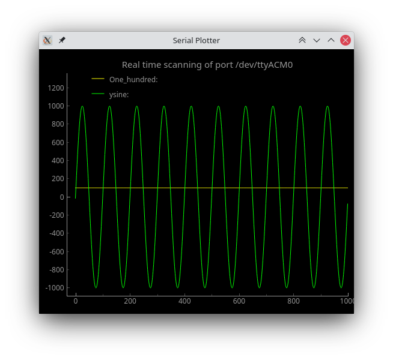

# Serial Plotter

Developped by eduardobehr.
This personal project is meant to read data from the serial port and plot them in real time. Although the data is not logged, this feature might be added in the future.



Compatibility: this software relies on open-source cross-platform libraries that should allow it to run in any x86-64 platform, although it was only tested on 64 bits Linux.

## Serial format
In order to parse the serial data, you must provide it with the following format (white space separated, one line at a time):
```
variable1 123\n
variable2 31415\n
```


## Note
- The time array is not precise and robust enough for reliable use.
- Using uncompiled Python, the realtime sampling rate reached something around 50 Hz to 60Hz. 
	- If you must get all the data, make sure the microcontroller respects this limit. Usually, 25ms is enough to garantee reliable results.

## Features
- If connection is lost, the program keeps retrying connection. If connection is restablished, it plots from where it stopped.
- If multiple ports are found (tty or COM), the program prompts the user to choose then port to listen to.
- Multithreading: Main thread operates the GUI and the child thread listens to the serial port
- Dynamic curves and legend: curves and legends are added at runtime and can be removed after its liftime has passed (set with constant CURVES_LIFETIME)


## Known bugs

- Serial ports may frequently send corrupted variable names, depending on the time the serial reader starts to listen to the port. Since the program won't be able do distinguish correct data from corrupt, it assumes the data is correct if it keeps being updated. Otherwise, if the data is no longer updated, its curve is dropped from the plot and no longer used.
- [FIXED] Pass ```str``` instead of ```int``` to allow the representation of ```float``` without the deprecationg warning from PyQt5's signal.emit method.

## To do

- Add and update actual time vector to display
